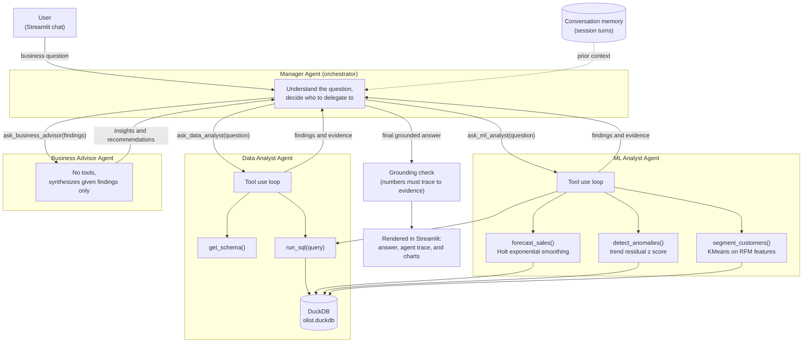

# Agentic AI Business Analyst for the Olist Marketplace

This project is my submission for the MBCIE Centre for AI technical assessment. The brief asked for an agentic AI business analyst that can independently explore the Olist Brazilian ecommerce dataset and answer open business questions with real reasoning, not canned lookups, so that is what I built.

Ask it something like "why did sales decline, and which sellers contributed most to it" and it will actually go figure that out: query the database, run some statistics, and come back with an answer backed by numbers it can point to.

## What it does

The system is built around a small team of cooperating agents rather than a single model trying to do everything at once.

* A **Manager Agent** reads the question, decides what needs to be looked into, and coordinates the rest of the team.
* A **Data Analyst Agent** answers factual and quantitative questions by querying the dataset directly.
* An **ML Analyst Agent** applies forecasting, anomaly detection, and customer segmentation when the question calls for it.
* A **Business Advisor Agent** takes whatever the other two found and turns it into a plain language answer with concrete recommendations.

Each of these is a genuinely separate call to a language model with its own instructions and its own tools. The Manager itself has no access to the data at all; it can only get answers by asking one of the specialists, which means every number that ends up in the final answer had to come from an actual query or calculation somewhere along the way.

## How it works



(Source for this diagram is in `diagram/architecture.mmd` if you want to edit it.)

A typical run through the flagship example question looks like this: the Manager asks the Data Analyst which month had the sharpest drop in revenue and which sellers were behind it, asks the ML Analyst to confirm whether that drop is statistically meaningful, then hands both sets of findings to the Business Advisor to turn into a proper answer with reasoning and next steps. Every step is visible afterward in an "Agent trace" panel under the answer, so you can see exactly which tool was called, with what arguments, and what came back.

### A few deliberate design choices

I wanted the grounding requirement (never state a number you cannot back up) to be structural rather than just a polite request in a prompt, so:

* The Manager cannot query the dataset itself. It can only learn things by asking a specialist, so there is no path for it to make up a figure on its own.
* The Business Advisor has no tools at all. It can only work with what it was handed, so it cannot introduce a brand new number that nobody actually looked up.
* After the Manager produces a final answer, a grounding check scans it for numeric claims and verifies each one appears somewhere in the evidence the specialists actually returned. Anything that does not match gets flagged in the interface rather than being trusted quietly.
* For questions that ask "why did something change," I added two small analysis tools, `find_largest_decline` and `compare_periods`, so the agent does not have to hand write a window function query from scratch every time. That turned out to matter a lot in practice: asking a model to write a correct SQL query with `LAG()` and a self join on the fly is a much less reliable path than giving it a tool that already does that calculation correctly.

## Requirement coverage

| Assignment requirement | Where it lives |
|---|---|
| Agentic workflow with multiple tools | Four agents in `agents/`, seven tools in total across SQL and ML |
| SQL or data analysis tool | `agents/tools_sql.py`, `get_schema` and `run_sql` over DuckDB, plus `find_largest_decline` and `compare_periods` for root cause questions |
| At least one ML capability | `agents/tools_ml.py`, forecasting with Holt exponential smoothing, anomaly detection with trend residual z scores, customer segmentation with KMeans on RFM features |
| Business analytics dashboard | `app.py`, a Streamlit chat interface with an agent trace panel and Plotly charts |
| Memory across the conversation | `agents/memory.py` plus Streamlit session state; earlier questions and answers are passed into every Manager call |
| Grounded answers | The grounding check described above, and system prompts that explicitly forbid uncited figures |
| Error handling and validation | `run_sql` only accepts read only statements and self corrects on a database error, ML tools check they have enough data before running, and the app surfaces a clear message instead of crashing if anything goes wrong |
| Architecture diagram and documentation | This file, and `diagram/architecture.mmd` |
| Bonus: multiple specialized agents coordinated by a manager | Implemented as the core design, not an add on |

## Getting started

A prebuilt `olist.duckdb` is included directly in the repository, so cloning it is enough to run the app immediately. The raw CSV download and build step below are only needed if you want to rebuild the database yourself, for example after updating the data.

### What you need

* Python 3.10 or newer
* A free Groq API key (no credit card needed) from `console.groq.com`
* The Olist dataset from Kaggle, only if you plan to rebuild the database

### Setting it up

Clone the repository and move into it:

```bash
git clone https://github.com/Sid8204/agentic-ai-business-analyst.git
cd agentic-ai-business-analyst
```

Create a virtual environment and install the dependencies:

```bash
python -m venv .venv
.venv\Scripts\activate
pip install -r requirements.txt
```

(On macOS or Linux, activate it with `source .venv/bin/activate` instead.)

Download the dataset from `https://www.kaggle.com/datasets/olistbr/brazilian-ecommerce`, unzip it, and place the CSV files in a folder called `data/raw` inside the project. You should end up with files like `data/raw/olist_orders_dataset.csv`, `data/raw/olist_order_items_dataset.csv`, and so on.

Build the database from those CSV files:

```bash
python db/build_db.py
```

This creates `olist.duckdb` in the project folder along with a handful of cleaned up views that the agents use as their starting point for trend questions.

Set up your API key. Copy `.env.example` to a new file named `.env`, and put your Groq key in it:

```
GROQ_API_KEY=your_key_here
```

You can get a free key by signing up at `console.groq.com` and creating one under API Keys. No payment details are required for the free tier used here.

### Running it

Start the app with:

```bash
streamlit run app.py
```

It will open in your browser, usually at `http://localhost:8501`. Type a business question into the chat box at the bottom and press enter.

A few questions that work well to try first:

* Why did sales decline, and which sellers contributed most to it?
* What was total revenue in 2018, and how did it compare to 2017?
* Segment our customers and tell me which segment we should focus retention efforts on, with a sales forecast for context.
* Which product categories are underperforming and why?

After an answer appears, click the "Agent trace" expander underneath it to see exactly which agents were consulted, which tools they called, what arguments they used, and whether the grounding check passed. If a chart is relevant to the answer (a forecast, an anomaly plot, or customer segments) it will render automatically below the trace.

You can ask follow up questions in the same conversation and the system will remember what was discussed earlier, so you do not need to repeat context. There is a "Clear conversation" button in the sidebar if you want to start fresh.

The sidebar also shows a quick overview of the dataset itself: row counts for the main tables and the date range the orders span.

### Stopping and restarting

To stop the app, go back to the terminal it is running in and press Ctrl+C. To run it again later, just repeat the `streamlit run app.py` step; there is no need to rebuild the database unless you change or replace the source CSV files.

## Project layout

```
agents/
  base_agent.py              the shared tool use loop every agent runs on top of
  tools_sql.py                get_schema, run_sql, find_largest_decline, compare_periods
  tools_ml.py                  forecast_sales, detect_anomalies, segment_customers
  data_analyst_agent.py       the Data Analyst specialist
  ml_analyst_agent.py         the ML Analyst specialist
  business_advisor_agent.py   the Business Advisor specialist, no tools by design
  manager_agent.py            the orchestrator, plus the grounding check
  memory.py                    formats prior turns for the Manager
db/
  build_db.py                 loads the CSVs into DuckDB and builds the analyst views
app.py                         the Streamlit dashboard
diagram/architecture.mmd       source for the architecture diagram above
docs/demo_script.md            a script I used to record the walkthrough video
```

## A note on the data itself

The Olist dataset is not perfectly clean, and it is worth knowing this going in. A handful of orders from September, October, and December 2016 are pre launch test orders with almost no volume (November 2016 has none at all), and the final month in the dataset, September 2018, is cut off partway through by the data collection window rather than representing a full month. Treating either of those as real business signal would be misleading, so the main analyst views (`monthly_sales`, `seller_performance`, `category_performance`) are scoped to the real operating window of January 2017 through August 2018 at the database level. The raw tables still contain the full history for cases where that is genuinely useful, such as calculating how recently a customer last purchased, and the agents are explicitly instructed to flag it if a question pushes them toward comparing against 2016 as though it were a normal year.

## Known limitations

* The grounding check works by matching numbers in the final answer against numbers returned by the tools. It is a solid heuristic and catches fabricated figures reliably, but it is not a formal proof of correctness.
* Conversation memory lives only in the current browser session. Closing the tab or restarting the app clears it, which was a deliberate scope decision rather than an oversight.
* Groq's free tier applies both a per minute rate limit and a daily token limit per model. Short rate limit waits are retried automatically; if the daily limit is ever hit, the affected agent returns a clear message asking you to try again later instead of the app crashing.

## About this submission

Built by Siddharth for the Agentic AI Data Science Assignment set by MBCIE Centre for AI. The dataset used is the Olist Brazilian ecommerce dataset from Kaggle, and the full source code, this documentation, the architecture diagram, and a recorded walkthrough are all part of the submission.
