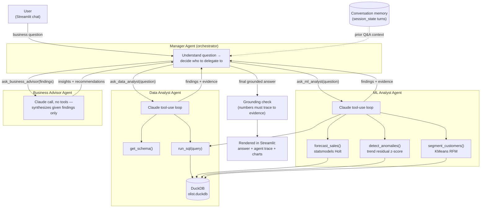

# Agentic AI Business Analyst — Olist E-Commerce

An agentic AI system that answers open-ended business questions over the
[Olist Brazilian E-Commerce dataset](https://www.kaggle.com/datasets/olistbr/brazilian-ecommerce)
by delegating across a **Manager Agent**, a **Data Analyst Agent**, an
**ML Analyst Agent**, and a **Business Advisor Agent** — each a real,
independent LLM tool-use loop (Groq's free API, `openai/gpt-oss-120b`)
with its own system prompt, tools, and reasoning trace.

Built for the MBCIE Centre for AI technical assessment.

## Example

> **Q: Why did sales decline, and which sellers contributed most to it?**
>
> The Manager delegates to the Data Analyst (finds the declining month +
> the sellers driving it via SQL) and the ML Analyst (confirms it
> statistically via anomaly detection on the trend), then hands both sets
> of findings to the Business Advisor, which synthesizes a grounded answer
> with concrete recommendations — visible step-by-step in the "Agent
> trace" panel under every answer.

## Architecture



Source: [`diagram/architecture.mmd`](diagram/architecture.mmd).

### Why this design

- **Real multi-agent, not role-play**: each specialist is its own LLM API
  call with its own system prompt and tool set — not one model pretending
  to be three roles in a single completion.
- **The Manager has no data access.** It can only reach the dataset by
  delegating, which forces every quantitative claim to flow through an
  agent that actually queried something.
- **The Business Advisor has no tools at all.** It can only reason over
  the findings it's handed, so it structurally cannot invent a new figure
  — it can misinterpret given evidence, but it cannot fabricate a number
  from nothing.
- **Grounding check**: after the Manager produces a final answer, every
  number in it is checked against the evidence actually returned by tool
  calls; anything that doesn't match is flagged in the UI rather than
  silently trusted.

## Minimum requirements → where they're implemented

| Requirement | Implementation |
|---|---|
| Agentic workflow, multiple tools | 4 agents ([`agents/`](agents/)), 7 tools across SQL + ML |
| SQL / data-analysis tool | [`agents/tools_sql.py`](agents/tools_sql.py) — `get_schema`, `run_sql`, plus two purpose-built analysis tools (`find_largest_decline`, `compare_periods`) that replace error-prone hand-written window-function SQL for root-cause questions |
| ML capability | [`agents/tools_ml.py`](agents/tools_ml.py) — forecasting (Holt exponential smoothing), anomaly detection (trend-residual z-scores), customer segmentation (KMeans on RFM) |
| Dashboard / UI | [`app.py`](app.py) — Streamlit chat, agent trace panel, Plotly charts |
| Memory / conversation state | [`agents/memory.py`](agents/memory.py) + `st.session_state`; prior Q&A passed into every Manager call |
| Grounded answers | `_check_grounding` in [`agents/manager_agent.py`](agents/manager_agent.py); tool-level system prompts forbid uncited numbers |
| Error handling / validation | SQL is read-only-validated and self-correcting on error ([`tools_sql.py`](agents/tools_sql.py)); ML tools validate sufficient data before running; the UI never crashes on an agent failure |
| Architecture diagram + docs | This file + [`diagram/architecture.mmd`](diagram/architecture.mmd) |

**Bonus (multi-agent):** implemented as described above — Manager +
Data Analyst + ML Analyst + Business Advisor.

## Setup

```bash
git clone https://github.com/Sid8204/agentic-ai-business-analyst.git
cd agentic-ai-business-analyst
python -m venv .venv
.venv\Scripts\activate      # Windows
pip install -r requirements.txt
```

1. Download the [Olist dataset](https://www.kaggle.com/datasets/olistbr/brazilian-ecommerce)
   and extract the CSVs into `data/raw/`.
2. Build the database: `python db/build_db.py`
3. Copy `.env.example` to `.env` and add a free `GROQ_API_KEY` from
   [console.groq.com](https://console.groq.com) (no credit card required).
4. Run the app: `streamlit run app.py`

## Project structure

```
agents/
  base_agent.py            Generic tool-use loop (Groq API) shared by every agent
  tools_sql.py              get_schema, run_sql (DuckDB)
  tools_ml.py                forecast_sales, detect_anomalies, segment_customers
  data_analyst_agent.py     Specialist: SQL fact-finding
  ml_analyst_agent.py       Specialist: forecasting/anomalies/segmentation
  business_advisor_agent.py Specialist: synthesis + recommendations, no tools
  manager_agent.py          Orchestrator: delegation + grounding check
  memory.py                  Conversation history formatting
db/
  build_db.py               Loads Olist CSVs into DuckDB + analyst views
app.py                       Streamlit dashboard
diagram/architecture.mmd     Architecture diagram source
```

## Known limitations

- The Olist dataset has data-quality artifacts: a handful of near-zero
  "seed" orders in Sep/Oct/Dec 2016 (Nov 2016 is missing entirely) and a
  truncated final month (Sep 2018, 1 order — the dataset's collection
  cutoff). The analyst views (`monthly_sales`, `seller_performance`,
  `category_performance`) are filtered to the real operational window
  (2017-01–2018-08) at the database level, not just by prompt instruction.
  Raw tables still contain 2016 data (needed for full customer history in
  segmentation), so the Data Analyst's system prompt and schema
  descriptions explicitly flag that any 2016 comparison is misleading
  (e.g. a literal "2017 vs 2016" calculation produces a technically-correct
  but meaningless "10,000%+ growth" figure) — this surfaced during testing
  and is now called out rather than silently reported.
- The grounding check is a heuristic (numeric substring match against
  tool evidence) — it catches fabricated figures but isn't a formal
  verifier.
- No persistent storage of conversation history across app restarts
  (memory lives in the Streamlit session only, by design for this scope).
- Groq's free tier enforces a per-model daily token cap (200k/day for
  `openai/gpt-oss-120b` at time of writing) in addition to a per-minute
  rate limit. Short per-minute limits are retried automatically
  ([`agents/base_agent.py`](agents/base_agent.py)); if the daily cap is
  exhausted, the affected agent returns a clear "rate limit hit, try again
  later" message instead of crashing — this surfaced during our own
  development testing and is handled, not hypothetical.
- Forcing a tool call on an agent's first turn (so it can't answer a data
  question "from memory") occasionally backfires when the model correctly
  decides no tool is needed — e.g. explaining why a 2016 comparison is
  invalid needs no query. Groq's API rejects that case outright, but the
  model's intended answer is still recoverable from the error payload and
  is used instead of surfacing a raw API error ([`agents/base_agent.py`](agents/base_agent.py)).
